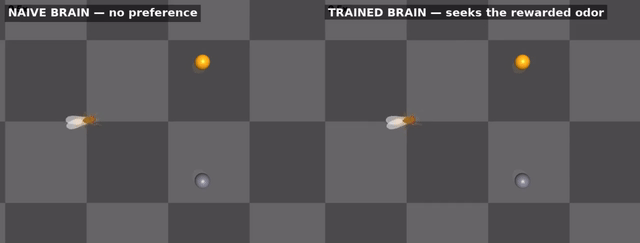

# fly-api 🪰

**Deploy and train the fruit-fly connectome in realistic simulation.**

A fruit fly's complete wiring diagram — 139,255 neurons, 50M+ synapses
([FlyWire](https://flywire.ai)) — running as a working nervous system.

> **Being upfront:** the science and most of the code here existed already
> (FlyWire, Shiu et al., flygym) — our part so far is reproduction,
> integration, two upstream bug fixes, and packaging. The full ledger:
> [docs/prior-art.md](docs/prior-art.md).

<p align="center">
  
  <br>
  <em>The fly chases a target using only its own retina. Insets: what each eye sees.</em>
</p>

**👉 Read the full story: [Waking the Fly Brain](https://dtch1997.github.io/fly-api/)**

## What works today

| | Demo | Result |
|---|---|---|
| 🧠 | **Taste → motor, through real wiring** | Sugar input drives the "eat" motor neuron (0→92 Hz, dose-dependent). Bitter vetoes it (93% suppression). **Zero training.** |
| 🦿 | **Walking** | Anatomically detailed MuJoCo fly, tripod gait + commanded turns ([video](media/b1_walking.mp4)) |
| 👁 | **Seeing** | Closed-loop visual pursuit from 721-ommatidia retina readings ([video](media/b2_taxis_with_retina.mp4)) |
| 🎓 | **Learning** | Classical conditioning in the olfactory→MB pathway: 99% suppression of the rewarded odor, graded generalization with similarity ([report](experiments/learning/report.md)) |
| 🧭 | **Navigating** | Brain-in-the-loop: the conditioned brain steers the body to the rewarded odor; naive brain shows no preference ([video](media/nav_side_by_side.mp4), [report](experiments/navigation/report.md)) |

Everything runs on a **CPU-only box** — no GPU, no sudo.

<p align="center">
  
  <br>
  <em>Brain-in-the-loop: naive vs conditioned — same fly, only the synapses differ.</em>
</p>

## Why

The field has built every layer around the connectome — but no glue:

| Layer | Who built it |
|---|---|
| Whole-brain spiking dynamics | [Shiu et al.](https://github.com/philshiu/Drosophila_brain_model), [BrainTrace](https://github.com/chaobrain/fitting_drosophila_whole_brain_spiking_model) |
| Realistic fly bodies | [flybody](https://github.com/google-deepmind/mujoco_menagerie/blob/main/flybody/README.md), [NeuroMechFly](https://neuromechfly.org) |
| Training on the graph | [flyvis](https://github.com/TuragaLab/flyvis), [FlyGM](https://arxiv.org/abs/2602.17997) |

Each result is a bespoke codebase. **fly-api aims to be the seam:**

> load connectome → pick neuron model → attach body → train

## How the fly navigates to the learned odor

No policy network, no path planner. The loop, once per decision step
(~0.15 s of walking):

```
 antenna positions ──► local odor concentrations (cA, cB)   [two Gaussian
 (from body pose)      at the left and right antenna         odor fields]
        │
        ▼
 one 150 ms "sniff" per antenna: the mixture drives odor A's and
 odor B's ORN classes in the LIVE spiking brain (8,991 LIF neurons,
 FlyWire wiring) ──► valence = total MBON output (avoidance drive)
        │
        ▼
 steer toward the lower-valence antenna ──► descending drives
 [left, right] into the walking controller (CPG + reflexes)
```

Because conditioning depressed exactly the KC→MBON synapses carrying the
rewarded odor, that odor now produces *less* avoidance drive — so the
trained fly turns toward it, sniff by sniff, and the naive fly (identical
in every other way) has no preference. One emergent quirk we kept: deep
inside the rewarded odor the learned depression silences the MBON signal
on *both* antennae — the memory erases its own beacon at the goal — so
"valence silenced while odor is strong" is treated as arrival (stop and
feed), which is what real flies do there anyway.

**What's brain and what's glue:** the valence comes from the spiking
connectome on every sniff; the steering law (turn toward lower valence,
gains, arrival rule) is engineered demo glue, not a model of the
descending pathway. Details: [navigation report](experiments/navigation/report.md).

## What "training" looks like

For the technically minded: there is **no gradient descent, no backprop,
no dataset** — it's the fly's own three-factor learning rule, run as-is.

Three ingredients, straight from the biology:

1. **CS (the odor):** six ORN glomerulus classes driven at 500 Hz for
   0.5 s → the antennal lobe → a sparse (~1–4%), odor-specific,
   perfectly repeatable Kenyon-cell code.
2. **US (the reward):** PAM dopaminergic neurons driven at 60 Hz during
   the same episode. (In this LIF model the connectome's own sugar→DAN
   route is silent — we verified — so the reward is injected at the DANs,
   exactly what optogenetic conditioning does in real flies.)
3. **The plasticity rule:** dopamine-gated long-term depression at
   KC→MBON synapses. After any episode where PAMs fired:

   ```
   for every KC→MBON synapse whose presynaptic KC spiked this episode:
       w ← (1 − η) · w          # η = 0.5
   ```

The protocol is 5 pairings of `[odor A + dopamine]` interleaved with
`[odor B, nothing]`, plus pre/post tests and generalization probes —
about two minutes of wall-clock on a CPU. Pairing 1 depresses ~5.5k of
the 62k KC→MBON synapses; later pairings touch fewer (the code is
stable, weights just decay toward zero on it). In total ~3–7% of
KC→MBON weight mass moves and **nothing else in the brain changes**.

That tiny, targeted change is the whole memory: the trained odor's MBON
response collapses 99–100% (3 seeds), the control odor's doesn't move,
probes sharing 67/50/33/0% of the trained odor's input channels inherit
proportionally graded suppression — and the same weights, dropped into
the body loop above, produce odor-seeking behavior. Honest caveats (the
×20 KC→MBON readout-gain for spiking readouts, uniform rather than
compartment-specific LTD) are in the [learning report](experiments/learning/report.md).

## Quickstart

```bash
uv venv .venv --python 3.11
uv pip install --python .venv/bin/python brian2 flygym pandas pyarrow \
    matplotlib joblib networkx scipy opencv-python-headless "imageio[ffmpeg]"

# Demo A — whole-brain taste circuit (data ships in the model repo)
git clone --depth 1 https://github.com/philshiu/Drosophila_brain_model
.venv/bin/python demo/track_a_lif.py --model-dir Drosophila_brain_model

# Demo B — embodied walking + vision (headless? see demo/setup_env.sh)
cd demo && . ./setup_env.sh && ../.venv/bin/python track_b_embodied.py
```

Details, gotchas, and full method: [docs/demo-report.md](docs/demo-report.md).

## Roadmap

1. **Close the loop** — LIF motor neurons → body actuators, retina → sensory neurons
2. **The SDK seam** — neuron models and training strategies as plugins
3. **Train** — connectome vs rewired controls, on GPU

## Provenance

**What existed already vs. what's ours:** see the honest ledger in
[docs/prior-art.md](docs/prior-art.md).


Spun out of [dtch1997/jarvis](https://github.com/dtch1997/jarvis)
(`experiments/fly-connectome-demo`, PR #191). `demo/svt_*.py` are vendored
from [flygym](https://github.com/NeLy-EPFL/flygym) 1.2.1 (Apache-2.0) with
two upstream bug fixes, noted in the demo report. MIT license.
