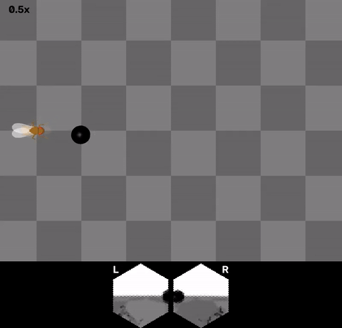
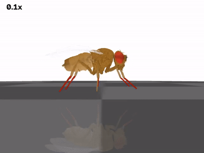

# fly-api 🪰

**Deploy and train the fruit-fly connectome in realistic simulation.**

A fruit fly's complete wiring diagram — 139,255 neurons, 50M+ synapses
([FlyWire](https://flywire.ai)) — running as a working nervous system.

> **Being upfront:** the science and most of the code here existed already
> (FlyWire, Shiu et al., flygym) — our part so far is reproduction,
> integration, two upstream bug fixes, and packaging. The full ledger:
> [docs/prior-art.md](docs/prior-art.md).

<p align="center">
  
  <br>
  <em>The fly chases a target using only its own retina. Insets: what each eye sees.</em>
</p>

**👉 Read the full story: [Waking the Fly Brain](https://dtch1997.github.io/fly-api/)**

## What works today

| | Demo | Result |
|---|---|---|
| 🧠 | **Taste → motor, through real wiring** | Sugar input drives the "eat" motor neuron (0→92 Hz, dose-dependent). Bitter vetoes it (93% suppression). **Zero training.** |
| 🦿 | **Walking** | Anatomically detailed MuJoCo fly, tripod gait + commanded turns ([video](media/b1_walking.mp4)) |
| 👁 | **Seeing** | Closed-loop visual pursuit from 721-ommatidia retina readings ([video](media/b2_taxis_with_retina.mp4)) |
| 🎓 | **Learning** | Classical conditioning in the olfactory→MB pathway: 99% suppression of the rewarded odor, graded generalization with similarity ([report](experiments/learning/report.md)) |

Everything runs on a **CPU-only box** — no GPU, no sudo.

<p align="center">
  
</p>

## Why

The field has built every layer around the connectome — but no glue:

| Layer | Who built it |
|---|---|
| Whole-brain spiking dynamics | [Shiu et al.](https://github.com/philshiu/Drosophila_brain_model), [BrainTrace](https://github.com/chaobrain/fitting_drosophila_whole_brain_spiking_model) |
| Realistic fly bodies | [flybody](https://github.com/google-deepmind/mujoco_menagerie/blob/main/flybody/README.md), [NeuroMechFly](https://neuromechfly.org) |
| Training on the graph | [flyvis](https://github.com/TuragaLab/flyvis), [FlyGM](https://arxiv.org/abs/2602.17997) |

Each result is a bespoke codebase. **fly-api aims to be the seam:**

> load connectome → pick neuron model → attach body → train

## Quickstart

```bash
uv venv .venv --python 3.11
uv pip install --python .venv/bin/python brian2 flygym pandas pyarrow \
    matplotlib joblib networkx scipy opencv-python-headless "imageio[ffmpeg]"

# Demo A — whole-brain taste circuit (data ships in the model repo)
git clone --depth 1 https://github.com/philshiu/Drosophila_brain_model
.venv/bin/python demo/track_a_lif.py --model-dir Drosophila_brain_model

# Demo B — embodied walking + vision (headless? see demo/setup_env.sh)
cd demo && . ./setup_env.sh && ../.venv/bin/python track_b_embodied.py
```

Details, gotchas, and full method: [docs/demo-report.md](docs/demo-report.md).

## Roadmap

1. **Close the loop** — LIF motor neurons → body actuators, retina → sensory neurons
2. **The SDK seam** — neuron models and training strategies as plugins
3. **Train** — connectome vs rewired controls, on GPU

## Provenance

**What existed already vs. what's ours:** see the honest ledger in
[docs/prior-art.md](docs/prior-art.md).


Spun out of [dtch1997/jarvis](https://github.com/dtch1997/jarvis)
(`experiments/fly-connectome-demo`, PR #191). `demo/svt_*.py` are vendored
from [flygym](https://github.com/NeLy-EPFL/flygym) 1.2.1 (Apache-2.0) with
two upstream bug fixes, noted in the demo report. MIT license.
