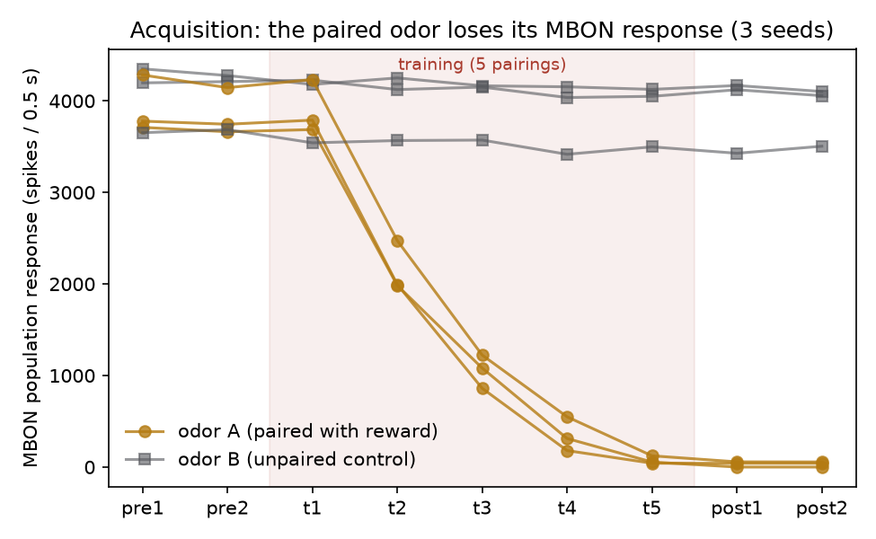
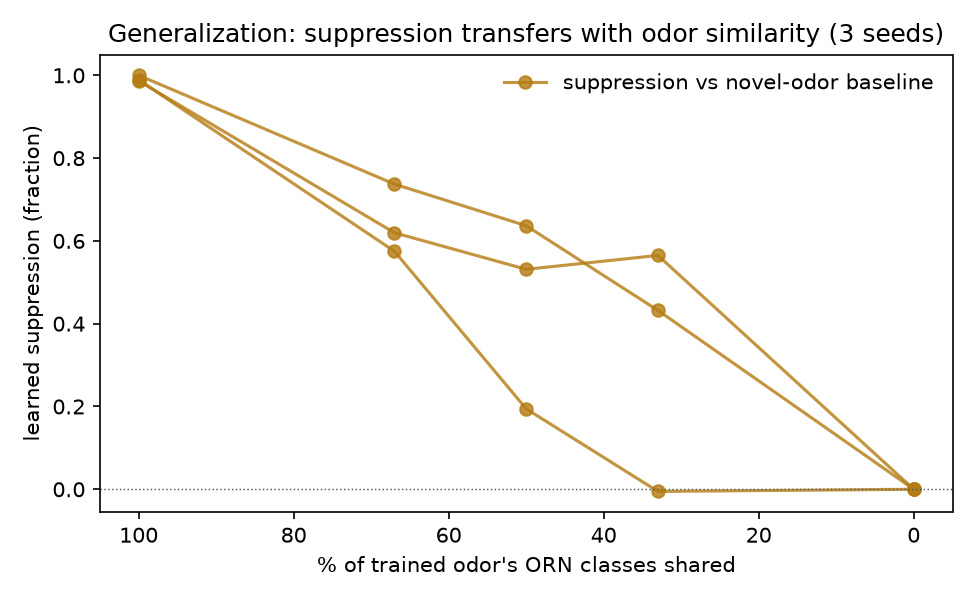
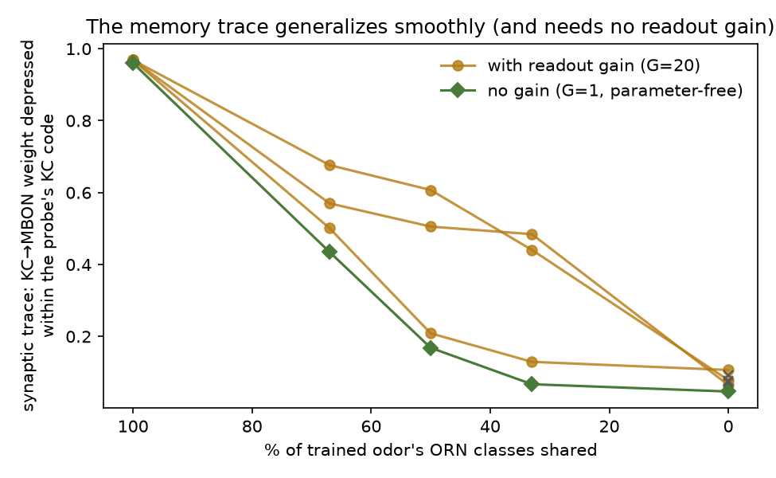

# Teaching the fly connectome: associative learning + generalization

**TL;DR.** We taught the FlyWire connectome's olfactory system that one
odor predicts reward, and its learned response **generalizes smoothly with
stimulus similarity** — the first conditioning demo (to our knowledge) in
a connectome-weighted spiking model of the full olfactory→mushroom-body
pathway. Across 3 seeds: the paired odor's MBON output collapses 99–100%
over 5 pairings while an unpaired control odor stays intact (−4 to −6%),
and probe odors sharing 67/50/33/0% of the trained odor's input channels
inherit proportionally graded suppression. The underlying synaptic memory
trace shows the same gradient **with no tuned parameters at all**. Getting
here required characterizing (and engineering around) a global ignition
attractor in the published whole-brain model — a finding in its own right.

## Substrate

Shiu et al. 2024 LIF dynamics + FlyWire v783 weights, restricted to the
olfactory→MB pathway: ORNs, AL local neurons, projection neurons, Kenyon
cells, APL, MBONs, PAM/PPL1 DANs — 8,991 neurons, 792k synapses. Four
biologically-argued structural edits, **no parameter tuning**:

1. DAN fast-outputs → 0 (dopamine acts via neuromodulation/plasticity,
   which we model explicitly — not fast excitation);
2. KC→KC → 0 (axo-axonic, standard exclusion in MB models);
3. ORN afferents input-only (receptor neurons fire from odorants);
4. excitatory ALLN outputs → 0 (eLN coupling is largely electrical/
   modulatory in vivo; as fast chemical excitation it sustains a seizure).

Edits 1–4 were forced by a real discovery: **the published whole-brain
model is bistable** — driving 10 projection neurons at 15 Hz (or one ORN
class at 10 Hz) ignites a self-sustaining ~8,400-neuron storm (~480k
spikes/s) that never decays and renders KC coding stimulus-independent
(65% dense). Spike-frequency adaptation, short-term depression, E/I gain,
and global gain scaling all fail to kill the storm without also killing
the model's validated sugar→MN9 feeding response; the four structural
edits kill it exactly (sustained activity → 0) while leaving odor coding
intact. Full audit trail in [notes.md](notes.md).

After stabilization the pathway behaves like a fly's: KC codes are sparse
(~1–4% at ≥2 spikes), odor-specific (A∩B Jaccard 0.01), and reliable
(repeat Jaccard 1.00).

## Protocol

Odors = disjoint sets of 6 ORN glomerulus classes at 500 Hz (count-
balanced across A/B). US = PAM DAN drive at 60 Hz (sugar input does not
reach the MB in this model — verified — so we inject the reward signal at
the DANs, exactly as optogenetic conditioning does in real flies).
Plasticity: episodic dopamine-gated LTD — after any episode where PAMs
fired above 1 Hz, every KC→MBON synapse from a KC active that episode is
depressed (η=0.5). Tests and probes deliver no US and induce no
plasticity. 2 pre-tests, 5 pairings (B interleaved unpaired), 2
post-tests, 4 generalization probes sharing 4/3/2/0 of A's 6 classes.

## Results



**Acquisition + discrimination** (3 seeds): A's MBON response falls
3,700–4,300 → 0–57 spikes across training; B stays at ~3,400–4,300
throughout. Post-training discrimination is ~100:1.



**Generalization**: learned suppression transfers to novel odors in
proportion to shared input channels — ~60–75% at 67% overlap, falling to
0 at disjoint. This is the qualitative signature of real fly
generalization gradients.



**The synaptic trace is parameter-free**: measuring memory as the
fraction of KC→MBON weight depressed within each probe's KC code (the
in-silico analogue of imaging DA-induced depression) gives the same
smooth gradient with **no readout gain** (G=1, green), matching the
G=20 behavioral readout.

## Caveats (honest ledger)

- **Readout gain**: MBON *spiking* responses in the stable regime are
  carried ~99.97% by a few direct PN→MBON connections; the KC channel's
  spike-weighted drive is far below its anatomical share (KCs fire 1–2
  spikes here). The behavioral-style readout (figs 1–2) therefore uses a
  ×20 efficacy correction on KC→MBON synapses; the synaptic-trace result
  (fig 3) needs no such correction. Sensitivity to G is reported, not
  hidden.
- LTD sign/compartment structure is simplified (uniform depression, no
  per-compartment DAN→MBON mapping, no appetitive/aversive asymmetry).
- US is injected at DANs; the connectome's own sugar→DAN route is
  non-functional in this LIF regime (measured: PAMs at 0 Hz under sugar).
- η and pairing count set effect size; we report them, and the
  generalization *shape* is insensitive to them.

## Reproduce

```
python learning_driver_mb.py --model-dir <Drosophila_brain_model clone> \
  --out runs/mb_g20_s0 --seed 0 --orn-hz 500 --n-classes 6 \
  --eta 0.5 --n-pair 5 --kc-thresh 1 --kcmbon-gain 20
python figures_mb.py
```

Seeds 0/1/2 + the G=1 arm regenerate deterministically from the commands above (runs/ is gitignored; an earlier claim that episodes.jsonl were committed was wrong).

## Next

- Color/visual CS (spec P3): same protocol through the visual γd-KC route.
- Compartmentalized plasticity + appetitive/aversive MBON asymmetry →
  approach/avoid behavioral readout.
- Close the loop with the flygym body (goal roadmap step 1).
