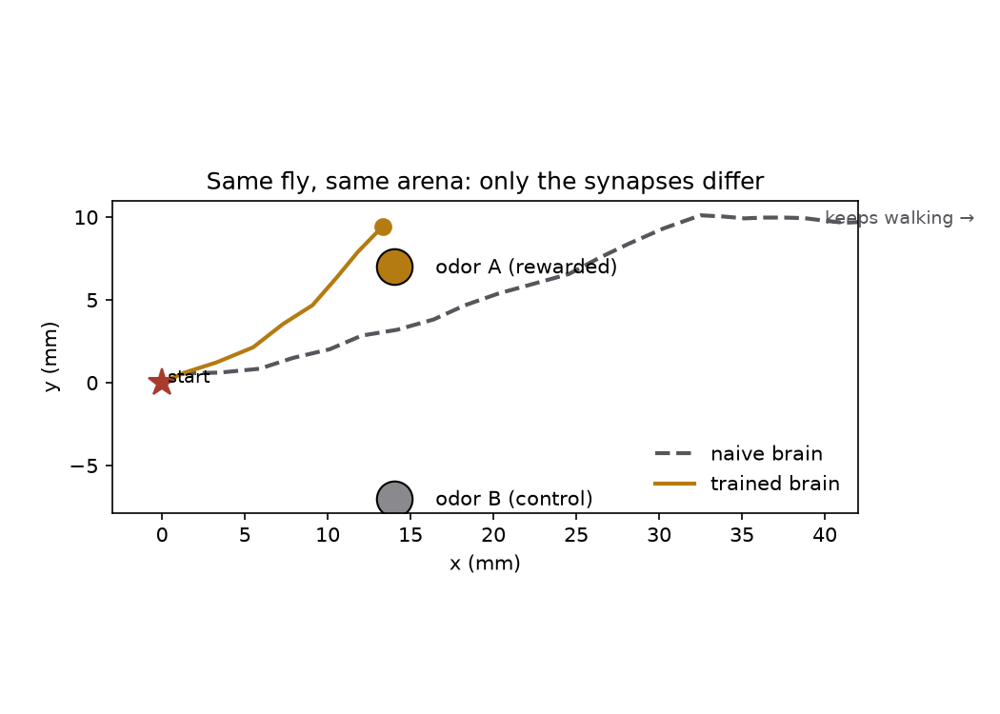

# Navigation demo: the fly walks toward the odor it learned to like

**TL;DR.** Closed-loop brain↔body: the connectome's olfactory-MB spiking
brain (8,991 LIF neurons, FlyWire weights, conditioned as in the learning
demo) steers the NeuroMechFly body in an arena with two odor sources.
Every decision step each antenna's local odor mixture is fed to the live
brain; MBON output (avoidance drive) per antenna sets the turning
command. **Same fly, same arena, only the KC→MBON synapses differ**: the
naive brain shows no preference and walks past both sources; the trained
brain homes to the rewarded odor in ~8 decisions (final distance 2.5 mm
vs 16.4 mm to the control source). Video: `runs/film/nav_side_by_side.mp4`.



## Mechanics

- Odor fields: isotropic Gaussians (σ=9 mm) around source A (rewarded,
  amber) at (14, 7) and source B (control, grey) at (14, −7).
- Sniff = 150 ms LIF episode: antenna's (cA, cB) scale the two odors' ORN
  class rates; valence = total MBON spikes.
- Steering: turn toward the antenna with lower MBON valence (MBONs here
  are read as avoidance drive; learned depression → approach). Guards:
  floored denominator, slow-walk when signal < threshold, stop within
  2.5 mm of a source.
- ~2 brain episodes per decision, 0.15 s body sim per decision
  (HybridTurningController); everything on CPU in one process.

## Honest notes

- Steering polarity and gains are engineered glue (this is a demo of the
  learned *valence*, not a model of the descending pathway); the learned
  signal itself comes from the conditioned brain, live, every sniff.
- Interesting emergent quirk: deep inside the rewarded odor the learned
  suppression erases the MBON signal entirely (both antennae → ~0), so
  the fly loses its compass at the goal — handled by the slow-walk guard.
  A compartment-resolved MBON readout would fix this properly.
- Naive control drifts slightly toward +y (the two odors' innate MBON
  drives aren't perfectly symmetric) but never approaches either source.

## Reproduce

```
python nav_demo.py --model-dir <Drosophila_brain_model clone> \
  --out runs/film --rollout both --n-decisions 40
python traj_figure.py
```
